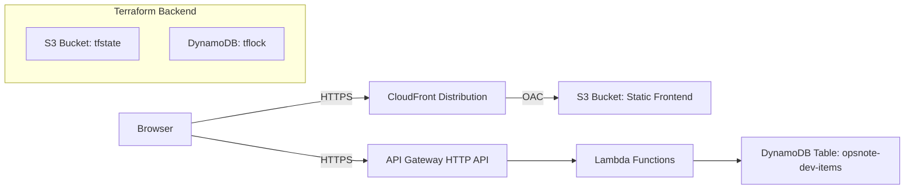
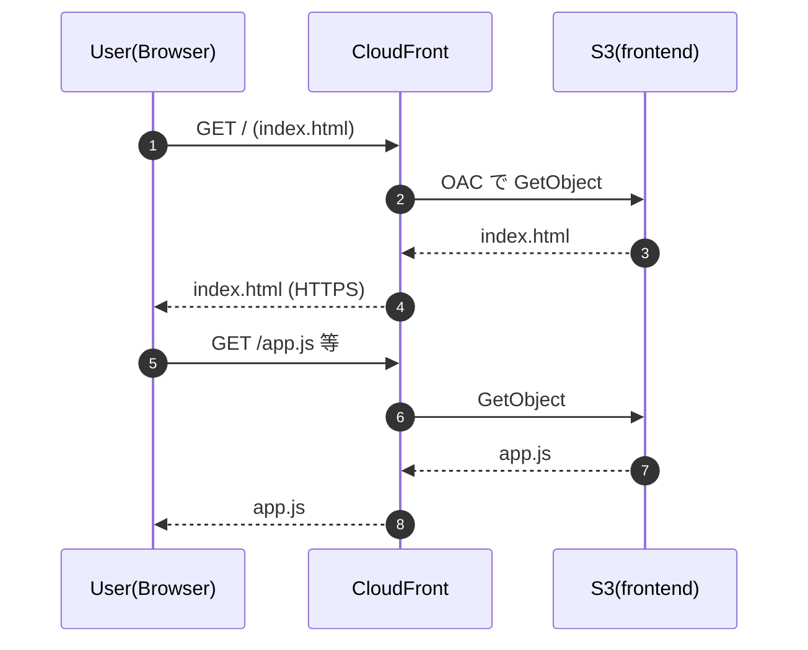
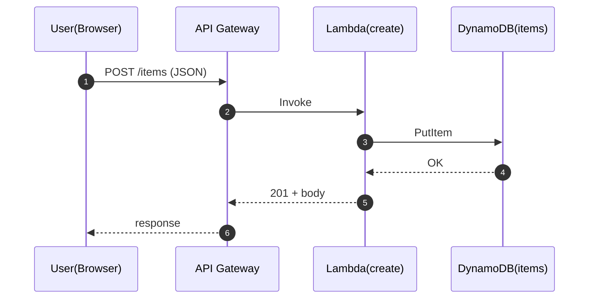

# Opsnote IaC（Terraform）解説資料

## 目的

* AWS 上の簡易アプリ（フロント＋API＋DB）を、Terraform で **再現可能**に構築する
* **開発（変更）→デプロイ（反映）→運用（監視/保守）**を一通り学ぶ
* 可能な限り **低コスト（月 $10 以下を目標）**で動く構成を採用する

---

## 1. 先に結論（本構成で何ができるか）

* ブラウザ（CloudFront 配信）からフォーム入力し、登録ボタンで API を叩く
* API Gateway → Lambda → DynamoDB にデータを書き込み・参照できる
* Terraform の state は **S3 に保存**し、同時 apply を **DynamoDB lock** で防止する
* S3 公開はやめて、**CloudFront + OAC で S3 を非公開**に保つ

---

## 2. 全体アーキテクチャ

### 主要コンポーネント（役割）

* **S3（frontend）**: 静的ファイル（HTML/JS/CSS）置き場
* **CloudFront（OAC）**: S3 を非公開のまま、外部へ HTTPS 配信
* **API Gateway（HTTP API）**: ブラウザからの API リクエスト入口
* **Lambda**: API の処理（登録/取得/一覧）
* **DynamoDB（items）**: データ永続化（サーバレスで低運用）
* **S3（tfstate） + DynamoDB（tflock）**: Terraform の状態管理（チーム運用の基礎）

---

## 3. ディレクトリ設計（意図）

典型的に 2 層に分けます（あなたの運用に合致）。

* `infra/bootstrap/`

  * **Terraform 自身のための土台**（tfstate bucket / lock table）を作る
  * 「最初に 1 回だけ」適用する前提
* `infra/app/`

  * アプリ本体（frontend / api / lambda / dynamodb / cloudfront…）を作る
  * 変更が発生するのはこちらが中心

> 教育上のポイント：
> **Terraform の backend 依存を解決するために bootstrap を分離**するのは王道です。最初に state 置き場を作らないと、以降の state 管理が不安定になります。

---

## 4. データフロー（処理の流れ）

### 4.1 フロント表示（静的配信）

### 4.2 登録（Create）

### 4.3 取得（Get/List）

* `GET /items/{id}` → get 用 Lambda → DynamoDB GetItem
* `GET /items` → list 用 Lambda → DynamoDB Scan/Query（設計次第）

---

## 5. セキュリティ設計の要点（初学者向けに重要）

### 5.1 「S3 公開」をやめた理由

S3 を公開（public read）すると、

* 誤って機密ファイルを置いたときに即漏えいする
* Public Access Block 等の制御と衝突しやすい

そのため本構成は **CloudFront + OAC で配信**し、S3 は非公開に保ちます。
（あなたが遭遇した `BlockPublicPolicy` による 403 は、この方針転換で根本解決しました。）

### 5.2 CloudFront OAC の意義

* CloudFront だけが S3 にアクセスできる
* ユーザーは CloudFront 経由でしか取得できない
* HTTPS やキャッシュ、地理的最適化も CloudFront 側で担える

### 5.3 CORS（ブラウザから API を呼ぶための必須設定）

* ブラウザは “別オリジン” の API を呼ぶ際、CORS 制約があります
* 正しい運用は「CloudFront ドメインだけ許可」

  * 例：`https://dr5272oen0ylg.cloudfront.net` のみ許可
* ここを広げすぎると、第三者サイトから API を勝手に叩かれる設計になります

---

## 6. Terraform モジュールの役割（概念整理）

あなたの構成は、概ね次のモジュール単位に分割されていると理解できます。

* `modules/dynamodb`

  * items テーブル（`opsnote-dev-items`）
* `modules/lambda`

  * create/get/list の Lambda
  * IAM Role/Policy（ログ出力、DynamoDB 操作）
  * zip ビルド成果物は Git 管理しない（`.gitignore`）
* `modules/apigw`

  * HTTP API + routes + integrations
* `modules/frontend_s3`（または相当）

  * S3 バケット（frontend）
  * ただし公開はしない（CloudFront からのみ）
* `modules/cloudfront`（または相当）

  * Distribution、OAC、S3 バケットポリシー（OAC用）

> 教育上のポイント：
> 「Terraform の module」は *部品化* であり、プログラムの関数に近い考え方です。
> 依存（API→Lambda→DDB 等）を output / input でつないで、全体を組み上げます。

---

## 7. 運用（初心者が押さえる最低限）

### 7.1 代表コマンド（app 側）

* 初回・更新共通：`terraform init` → `terraform plan` → `terraform apply`
* state は S3 にあり、lock は DynamoDB にあるので、PC が変わっても同じ環境を管理できます

### 7.2 何を確認すれば「動作確認」になるか

* `frontend_url` にアクセスして画面が表示される
* 登録ボタン押下で network を見て、API が 2xx を返す
* DynamoDB にアイテムが増える
* CloudFront のキャッシュ更新が必要な場合は invalidation を検討（更新が反映されないとき）

### 7.3 典型トラブル集（今回の学びを含む）

* フロントが反応しないがエラーがない

  * 例：`index.html` が `app.js` を読み込めていない（パス/コピペミス）
* S3 バケットポリシー 403

  * Public を禁止している（BlockPublicPolicy） → OAC 方針へ
* `.terraform/` を Git に入れて push 失敗

  * provider バイナリが巨大。`.terraform/` は必ず除外

---

## 8. コスト見積もり（目安と注意）

目標の $10/月 は **トラフィックが小さい学習用途なら十分現実的**です。ただし従量課金なので、アクセスが増えると増えます。

* Lambda：無料枠が大きい（少量ならほぼ無料）
* DynamoDB：PAY_PER_REQUEST で少量なら低コスト
* S3：数 MB〜数百 MB 程度なら低コスト
* CloudFront / API Gateway：アクセス数と転送量に依存（学習規模なら低め）

> 注意：動画や大容量ファイル配信、またはアクセス急増があると CloudFront が支配的になります。

---

## 9. 改善課題（次の学習テーマ）

### 9.1 DynamoDB のキー設計（Query）

* list を Scan に頼るとスケールしません
* `pk/sk` 設計や GSI を導入し、Query にするのが実務的

### 9.2 監視・ログ

* CloudWatch Logs の retention を Terraform 管理（コスト最適化）
* API Gateway の access log（必要なら）を有効化

### 9.3 本番運用に寄せるなら

* 追加環境（stg/prod）を workspace か複数ディレクトリで持つ
* IAM を最小権限へ（plan/apply の role policy を棚卸し）

---

## 10. 付録（ワークフローは不要とのことなので、ここでは IaC 側だけ）

### 10.1 出力例（あなたの環境）

* `api_endpoint = https://...execute-api.ap-northeast-1.amazonaws.com`
* `frontend_url = https://...cloudfront.net`
* `dynamodb_table = opsnote-dev-items`
* `frontend_bucket = opsnote-dev-site`

---

# 次にこちらでできること（どれか選んでください）

1. **IaC の章をさらに具体化**：各 module の変数・output・依存関係を “実コード準拠” で解説
2. **AWS CLI での再現手順書**：Terraform を補助する形で、AWS CLI で「同等構成を手作業で再現」する教育編（比較学習）
3. **運用手順（Runbook）**：障害時切り分け、復旧、コスト確認、ログ確認を手順化

最も精度を上げるには、`infra/app` と `infra/bootstrap` の **主要 `.tf`（main/variables/outputs と modules の main）**を貼ってもらえれば、実際のコードに完全一致する形で章立てを確定できます。とはいえ、現時点の情報だけでも上記は教育資料として十分に成立しています。
