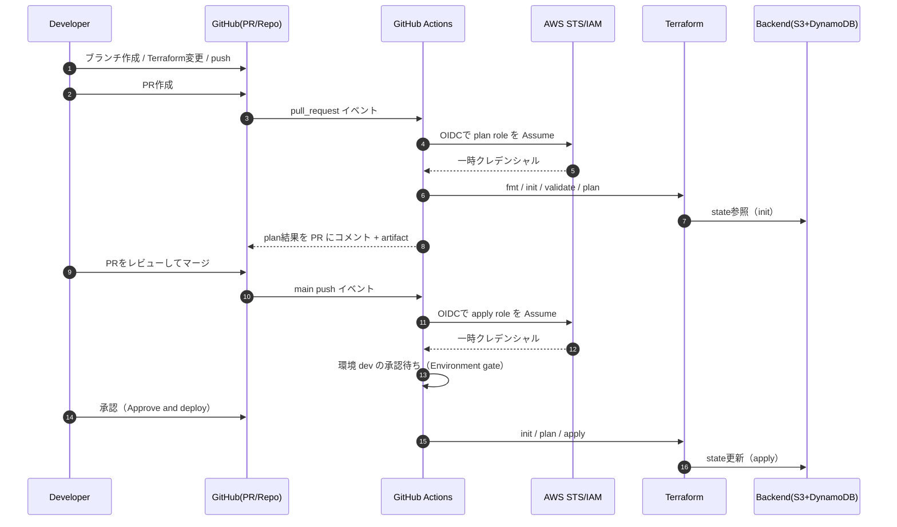

以下は、あなたが貼ってくれた **最終版ワークフロー（terraform-plan.yml / terraform-apply.yml）**を前提に、「GitHub に不慣れな読者でも一連の流れを理解できる」教育用 Markdown 資料として整形したものです。図解（Mermaid）も含めています。
（補足：`terraform-plan.yml` の `Debug OIDC subject (claims)` は教育・トラブルシュート用であり、通常運用では削除推奨です。）

---

# Opsnote 教育資料：Terraform × GitHub Actions で「PR で plan → 承認後に自動 apply」

## 1. この資料で学べること

* Terraform を GitHub で管理しながら、CI/CD 的に安全に反映する基本パターン
* GitHub Actions で次を自動化する方法

  * PR 作成時に `terraform plan` を実行して、差分を PR に出す
  * main へのマージ後に `terraform apply` を自動実行する
  * `apply` 前に「承認（Approval）」を必須化して事故を防ぐ
* AWS 認証を **OIDC（短期トークン）**で行い、GitHub に AWS Access Key を置かない設計

---

## 2. 全体像（運用フロー）

### 2.1 PR → plan → マージ → 承認 → apply



---

## 3. Git/GitHub の基本作法（初心者向け）

### 3.1 ブランチ運用とは

* **main**：安定して動く「本線」。ここが更新されると本番（相当）へ反映する。
* **作業ブランチ**：変更作業はここで行う（例：`feat/...`、`fix/...`）。
* **PR（Pull Request）**：作業ブランチの変更を main に取り込むための「レビュー依頼」。

この「PR でレビュー → main にマージ」という流れに CI（GitHub Actions）を組み込むと、変更の品質と安全性が上がります。

---

## 4. 目標と設計方針（なぜこうするか）

### 4.1 なぜ plan と apply を分けるのか

* `plan`：変更差分の確認（レビュー材料）
* `apply`：実際の変更（事故が起きうる）

**「差分の確認」と「反映」を分ける**ことで、レビューと統制が効きます。

### 4.2 なぜ AWS Access Key を使わないのか（OIDC）

GitHub Actions から AWS にアクセスする方法として、Access Key（長期資格情報）を GitHub に保存する方法は避けたいです。
代わりに **OIDC**を使うと、GitHub Actions の実行時に AWS STS で **短期の一時認証**を払い出せます。
結果として、秘密情報の取り扱いが楽になり、漏えいリスクも下がります。

---

## 5. GitHub 側の設定（本資料の前提）

### 5.1 GitHub Variables（値を YAML に直書きしない）

本構成は次の Variables を前提とします（repo 変数）。

* `TF_WORKING_DIR`：Terraform の実行ディレクトリ（例：`infra/app`）
* `AWS_REGION`：例 `ap-northeast-1`
* `AWS_ROLE_ARN_PLAN`：plan 用ロール ARN
* `AWS_ROLE_ARN_APPLY`：apply 用ロール ARN

確認：

```powershell
gh variable list -R qz75ha/opsnote
```

### 5.2 GitHub Environments `dev`（承認ゲート）

`terraform-apply.yml` の job に以下があることで、`dev` 環境の承認が必要になります。

```yaml
environment: dev
```

この環境 `dev` に **Required reviewers（承認者）**を設定しておけば、承認されるまで apply は止まります。

---

## 6. ワークフロー解説：terraform-apply.yml（main で自動 apply）

### 6.1 ファイル全体（あなたの最終版）

（省略せずに掲載したい場合は付録を参照）

### 6.2 重要ポイントを初心者向けに分解

#### (1) トリガー：main への push のみ

```yaml
on:
  push:
    branches: ["main"]
    paths:
      - "infra/**"
      - ".github/workflows/**"
```

* main が更新されたら apply を実行する
* `paths` を入れることで、Terraform 関連に変更が無い push では動かない（無駄を減らす）

#### (2) 権限：OIDC に必要な `id-token: write`

```yaml
permissions:
  contents: read
  id-token: write
```

* `id-token: write` が無いと、GitHub Actions が OIDC トークンを発行できず AssumeRole できません。
* `contents: read` は checkout に必要な最低限です。

#### (3) 多重実行防止：concurrency

```yaml
concurrency:
  group: terraform-apply-${{ github.ref }}
  cancel-in-progress: false
```

* 同じブランチ（main）で apply が重なって走ると危険です。
* `concurrency` で「同時実行」を抑制します。
* `cancel-in-progress: false` は、実行中の apply を別の実行で止めない（中断リスク回避）。

#### (4) 承認ゲート：environment: dev

```yaml
environment: dev
```

* これにより GitHub Environment の保護ルールが適用されます。
* Required reviewers が設定されていれば、承認されるまで apply は停止します。

#### (5) Terraform 実行ディレクトリを固定：defaults.run.working-directory

```yaml
defaults:
  run:
    shell: bash
    working-directory: ${{ vars.TF_WORKING_DIR }}
```

* Terraform をどこで実行するかは非常に重要です。
* `TF_WORKING_DIR=infra/app` のように repo 変数で管理すると、環境差分にも強いです。

#### (6) AWS 認証：configure-aws-credentials（OIDC）

```yaml
- name: Configure AWS credentials (OIDC)
  uses: aws-actions/configure-aws-credentials@v4
  with:
    role-to-assume: ${{ vars.AWS_ROLE_ARN_APPLY }}
    aws-region: ${{ vars.AWS_REGION }}
```

* apply 用ロールを Assume します。
* ロールの trust policy が正しくないと、ここで `AssumeRoleWithWebIdentity` が失敗します。

#### (7) init → plan → apply（main 上で再計算）

```yaml
terraform init -input=false
terraform plan ... -out=tfplan
terraform apply ... tfplan
```

* PR で作った plan をそのまま apply するのではなく、**main の状態で再計算**します。
* これにより「レビューした内容と main がズレている」事故を抑制します。

#### (8) Job Summary に plan を出す（安全版）

````yaml
printf "## Terraform plan (main)\n\n" >> "$GITHUB_STEP_SUMMARY"
printf "```\n" >> "$GITHUB_STEP_SUMMARY"
head -c 60000 plan.txt >> "$GITHUB_STEP_SUMMARY" || true
printf "\n```\n" >> "$GITHUB_STEP_SUMMARY"
````

* `echo '```'` はコピペ・文字化けで壊れやすいので、`printf` に変更済み。
* plan 出力は長くなりがちなので 60KB 程度で切っています。

---

## 7. ワークフロー解説：terraform-plan.yml（PR で plan を可視化）

### 7.1 トリガー：PR のみ

```yaml
on:
  pull_request:
    paths:
      - "infra/**"
      - ".github/workflows/**"
```

### 7.2 PR にコメントするため `pull-requests: write`

```yaml
permissions:
  contents: read
  pull-requests: write
  id-token: write
```

* plan 結果を PR にコメントするので `pull-requests: write` が必要です。

### 7.3 fmt/validate を入れる理由

```yaml
terraform fmt -check -recursive
terraform validate
```

* fmt は「コード規約」の崩れを早期に検知します。
* validate は「構文/型の矛盾」を事前に検知します。
* apply 前に “機械的に落とせるミス” を潰すのが目的です。

### 7.4 plan 結果の共有（artifact + PR コメント）

* artifact：後からダウンロードできる（監査・比較に有用）
* PR コメント：レビュー体験を良くする（PR を開けば差分が見える）

### 7.5 Debug OIDC subject (claims) について（重要）

あなたの `terraform-plan.yml` には以下が入っています。

```yaml
- name: Debug OIDC subject (claims)
  ...
  echo "$PAYLOAD" | jq '{sub,aud,iss,repository,ref,job_workflow_ref}'
```

これは **OIDC の trust policy が合わないときに原因特定するためのデバッグ**です。

* 学習用途：非常に良い（`sub` がどうなっているか理解できる）
* 通常運用：不要（ログを冗長化し、運用上の情報露出面を増やすため）

**推奨：運用が安定したら削除**するか、`if: ${{ runner.debug == '1' }}` のように限定実行にするのが良いです。

---

## 8. 代表的なトラブルと対処（今回の経験をテンプレ化）

### 8.1 OIDC で AssumeRole できない

**症状**

* `Not authorized to perform sts:AssumeRoleWithWebIdentity`

**原因**

* AWS 側 trust policy の条件（特に `sub`）が一致していない

**対処の定石**

1. まず `repo:OWNER/REPO:*` に広げて疎通
2. `sub` の実値をログで確認（今回の Debug step）
3. 最終的に PR / branch / environment 単位まで絞る

### 8.2 bash のクォートが壊れる（Job summary）

**症状**

* `unexpected EOF while looking for matching ...`

**対処**

* `printf` で堅牢に書く（あなたの最終版はすでに対応済み）

---

## 9. 次の改善（教育としての発展課題）

### 9.1 trust policy を最終形へ絞る

今は疎通優先で `repo:...:*` を使っている可能性があります。
運用が安定したら、例えば apply ロールを **`environment: dev` のみに限定**すると安全性が上がります。

### 9.2 IAM ポリシーの最小権限化

学習段階では AdministratorAccess でも良いですが、次は最小権限に落としていくのが実務的です。
（対象：S3 state、DynamoDB lock、Lambda、APIGW、CloudFront、S3 frontend、IAM の一部 など）

### 9.3 Branch protection（main 直 push 禁止）

* PR 経由だけで main 更新できるようにする
* 必須チェックを強制する
* レビュー必須化

---

## 追加提案（資料をさらに教育向けにするなら）

* 「AWS 側（OIDC Provider / Role / trust policy）を AWS CLI で作る手順」も、同じテンプレ形式で追記できます。
* `Debug OIDC subject` を “必要時のみ” 実行する形に改善（例：手動入力フラグで実行）。

必要なら、次に **AWS 側の trust policy の最終形（plan/apply）**を、あなたの現状に合わせて「最小権限・最小許可条件」へ落とした完成版も作ります。
